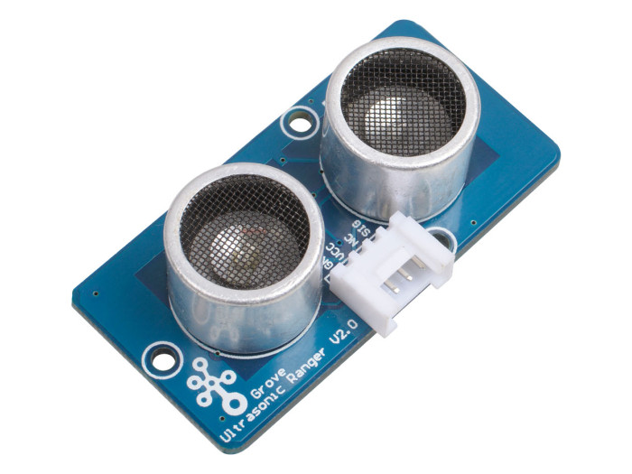
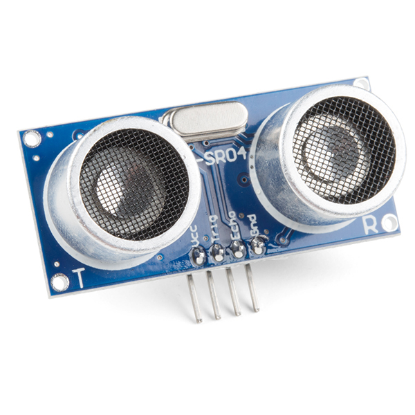
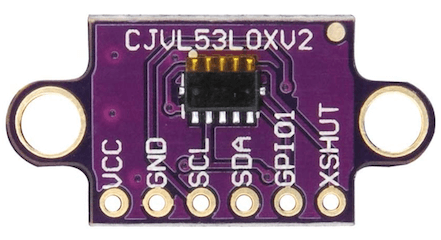
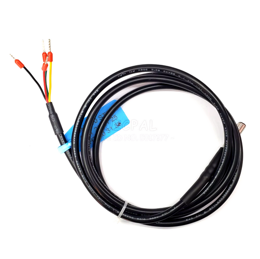
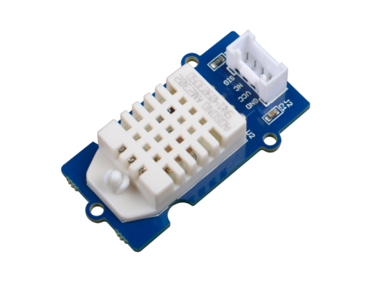
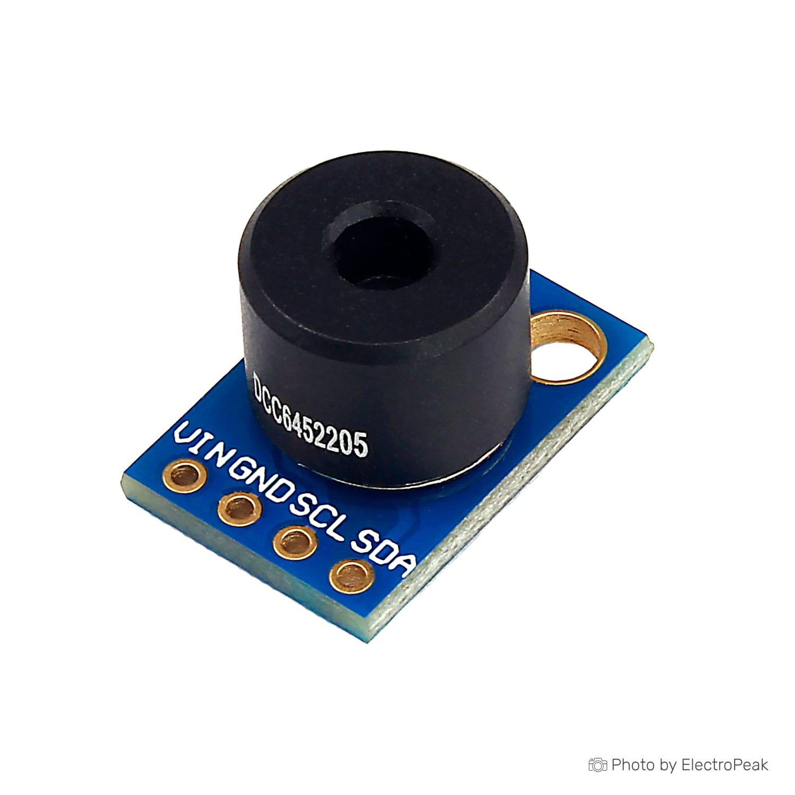
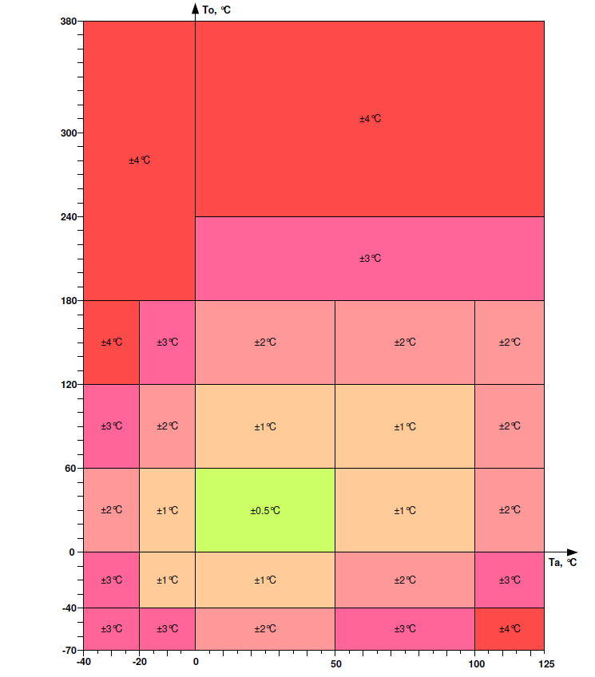
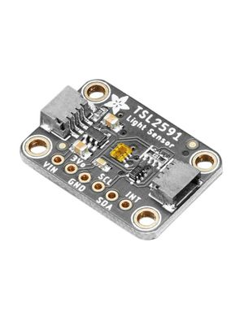
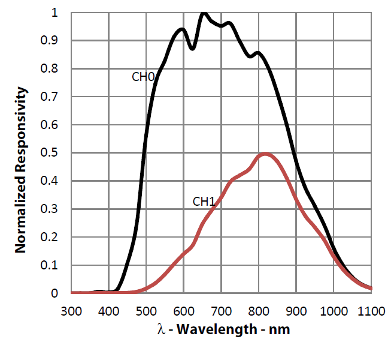
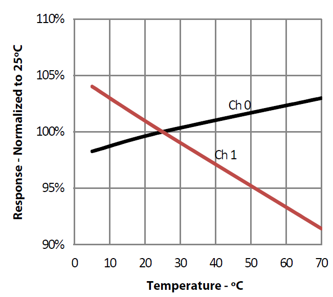

The following sensors have been tested on the Lilygo T-SIM7000G board. The [Lilygoboard](https://www.lilygo.cc/) has no 5V output pin, so all the sensor that have an operating voltage of 5V cannot be used directly with this board. However, they were still tested as the custom boards have a 5V pin. On the Lilygo board, the VIN_5V pin gives a 5V output when it's connected to a power supply via the USB-C port. More testing has been done anyways on the sensors that work with a 3.3V power supply. The prices of the sensors can vary depending on the website on which they are purchased. The prices listed below correspond to the sensors ordered in Switzerland from these two websites: [Conrad](https://www.conrad.ch/) and [Makersportal](https://makersportal.com/shop?tag=Sensors).

As a reminder, a good place to get some help on the [Arduino](https://www.arduino.cc/) programming is [RandomNerdTutorials](https://randomnerdtutorials.com/).

## Snow height measurement

### ✓ Sensors approved:

#### Grove Ultrasonic Distance sensor v2.0
[Datasheet](https://files.seeedstudio.com/wiki/Grove_Ultrasonic_Ranger/res/Grove-Ultrasonic_Ranger_WiKi.pdf)\
**Price:** CHF 5.65 (lowest price found: 3.50 CHF).\
The sensor functions use the following formula to calculate the distance from an object:\
Distance = echo signal high time * Sound speed (340M/S)/2

<table>
  <tr>
    <td>
      
    </td>
    <td>

|   |   |
|---|---|
| Operating voltage | 3.2-5.2 V |
| Measuring range | 2-350 cm |
| Resolution | 1 cm |
| Measurement angle | 15 ° |
| Working temperature | -10 °C to 60 °C |

  </tr>
</table>

#### HC-SR04 Ultrasonic Distance sensor
[Datasheet](https://cdn.sparkfun.com/datasheets/Sensors/Proximity/HCSR04.pdf)\
This sensor needs 5V operating voltage, so it is not possible to use it with the Lilygo TSIM7000G board.\
**Price:** $6.00 (lowest price found: 3 CHF).

<table>
  <tr>
    <td>
      
    </td>
    <td>

|   |   |
|---|---|
| Operating voltage | 2.6 - 3.5 V |
| Measured distance | up to 2 m |
| Measurement angle | 15 ° |
| Infrared emitter | 940 nm |

  </tr>
</table>

### ✘ Sensor not approved:

#### VL53L0X Laser rangefinder

[Datasheet](https://www.google.com/url?sa=t&source=web&rct=j&opi=89978449&url=https://www.st.com/resource/en/datasheet/vl53l0x.pdf&ved=2ahUKEwis_aTS-8GGAxWc_rsIHReqAT8QFnoECBIQAQ&usg=AOvVaw2D772P0Ms66VJ7lbKKynB-)\

This sensor has the same I2C address as the TSL2591 sensor, and it is not possible to change it either in software or in hardware. Furthermore, at ambient temperature (T around 25°C) it overestimates the distance by a couple centimeters.\
**Price:** $10.00 (lowest price found: $3.50).

<table>
  <tr>
    <td>
      
    </td>
    <td>

|   |   |
|---|---|
| Operating voltage | 5 V |
| Measuring range | 0.02 - 4 m |
| Measurement angle | 15 ° |
| Working temperature | -15 °C to 70 °C |

  </tr>
</table>

## Soil Moisture measurement

### ✓ Sensors approved:

#### SHT30 temperature and humidity sensor

[Datasheet](https://mm.digikey.com/Volume0/opasdata/d220001/medias/docus/1067/HT_DS_SHT3x_DIS.pdf)\
**Price:** CHF 6.50 ([Aliexpress](https://www.aliexpress.com/item/1005004632974749.html?spm=a2g0o.productlist.main.3.32094103TzlJOe&algo_pvid=38da8ea0-776b-42d4-b041-1a90a94ff0ec&algo_exp_id=38da8ea0-776b-42d4-b041-1a90a94ff0ec-1&pdp_npi=4%40dis%21TJS%21102.04%2176.56%21%21%219.57%217.18%21%40211b65d417201881695335604e497f%2112000029911511464%21sea%21CH%214099957806%21&curPageLogUid=wV9sY3cbAs58&utparam-url=scene%3Asearch%7Cquery_from%3A#nav-description)).\

<table>
  <tr>
    <td>
      
    </td>
    <td>

|   |   |
|---|---|
| Operating voltage | 2.15 - 5.5 V |
| Accuracy | +/- 2% RH, +/- 0.2 °C |
| Resolution | 0.01% RH, 0.01 °C |
| Range | 0% to 100% RH, -40 °C to 125 °C |
| Operating temperature range| -40 °C to 125 °C |

  </tr>
</table>

### ✘ Sensor not approved:

#### Grove Moisture sensor

This is a resistive soil moisture sensor, it is not resistant to corrosion and therefore not durable for long-term outside use.\
**Price:** CHF 4.90 (lowest price found: 3 CHF).

#### Capacitive Soil Moisture sensor v1.2

[Datasheet](https://mm.digikey.com/Volume0/opasdata/d220001/medias/docus/2107/SEN0193_Web.pdf)\
Due to a loose/faulty contact it stopped measuring accurate values after a couple uses, and is therefore not recommended.\
**Price:** $8.00 (lowest price found: 3.50 CHF).

## Air temperature and moisture measurement

### ✓ Sensors approved:

#### SHT30

See above.

#### Grove temperature and humidity sensor

[Datasheet](https://www.sparkfun.com/datasheets/Sensors/Temperature/DHT22.pdf)\
**Price:** 5.00 CHF

<table>
  <tr>
    <td>
      
    </td>
    <td>

|   |   |
|---|---|
| Operating voltage | 3.3 - 6 V |
| Accuracy | 2% RH, 0.5°C |
| Resolution | 0.1%, 0.1 °C |
| Range | 5%-99% RH, -40°C to 80°C |

  </tr>
</table>

## Surface temperature measurement

### ✓ Sensors approved:

#### MLX90614xCC Non-Contact Infrared Temperature Sensor (GY-906 IR)

[Datasheet](https://cdn-reichelt.de/documents/datenblatt/A300/SEN-IR-TEMP_MANUAL_2022-04-27.pdf)\
**Price:** CHF 5.50 (Aliexpress).

<table>
  <tr>
    <td>
      
    </td>
    <td>

|   |   |
|---|---|
| Operating voltage | 3.3 - 5 V |
| Accuracy | 0.5 °C within T range of 0 °C-50 °C|
| Resolution | 0.02 °C |
| Operating T range | -40°C to 85°C |
| Ambient T range | -40°C to 125°C |
| Object T range | -70°C to 380°C |

  </tr>
</table>

Temperature accuracy (Ta = ambient T, To = object T), taken from the datasheet:

{width=45%}

## Irradiance measurement/light sensors

### ✓ Sensors approved:

#### Adafruit TSL2591 - High Dynamic Range Digital Light Sensor

[Datasheet](https://cdn-shop.adafruit.com/datasheets/TSL25911_Datasheet_EN_v1.pdf)\
**Price:** CHF 16.95 (lowest price found: 6.50 CHF).

<table>
  <tr>
    <td>
      
    </td>
    <td>

|   |   |
|---|---|
| Operating voltage | 3.8 V |
| Accuracy | 0.5 °C within T range of 0 °C-50 °C|
| Number photodiodes | 2 |
| Channel 0 | Full spectrum |
| Channel 1 | IR |

  </tr>
</table>

Spectral responsivity (left) and Response to white LED vs. Temperature (right), taken from the datasheet:

{width=40%}
{width=40%}

### ✘ Sensors not approved:

#### BH1750 Ambient Light sensor

Measures only illuminance (unit: lux). It is not possible to derive irradiance from illuminance.\
**Price: $6.00** (lowest price found: 2 CHF).

## Rain Gauge

### ✓ Sensors approved:

#### Class Hall Magnetic Sensor (SE054)

[Datasheet](https://asset.conrad.com/media10/add/160267/c1/-/en/001485327DS01/datenblatt-1485327-iduino-1485327-hallsensor-passend-fuer-einplatinen-computer-arduino-1-st.pdf)\
Needs 5V operating voltage. However, due to lack of time, this sensor was not tested and not implemented in the measuring station.\
**Price:** CHF 2.45 (lowest price found: 1.50 euros).

## Documentation of problems encountered:

- I2C address conflict between VL53V0X and TSL2591: Both sensors use the I2C address 0x29. As opposed to the TSL2591 sensor where the address is fixed, for the VL53L0X the I2C address can be changes in software. After changing the address of the VL53L0X sensor (for example to 0x30) and after checking that the address was successfully changes thanks to an I2C address-scanner sketch, this sensors still fails to initialize when connected when the TSL2591 is also connected to the board. After many tries (for example after changing the I2C address in the header files, or using the XSHUT-pin to shut down the sensor while before initializing it with a different address), we decided to give up using this sensor, as we already have other two ultrasonic sensors that measure the distance. However, an advantage of using a laser sensor to measure snow height is that the sensor could have been placed in a protective glass casing, without influencing the distance measurement. The ultrasonic distance sensor can't be placed in a protective casing, otherwise it will measure the lid of the casing instead of the surface. The problem persisted also when both sensors where connected to the board, and when the VL53V0X was initialized before the TSL2591 (within the sketch, the code for the initialization of the VL53L0X was placed before the initialization of the TSL2591). The only way that has been found to make them work together was when the TSl2591 was connected to the board only after the VL53L0X was initialized. Clearly, this is only a temporary solution for testing and is not compatible with a working weather station, since every time the station boots up to take measurements, the sensors are again initialized (within the setup() function of the sketch). An option would be to find a function that shuts down the TSL2591 (something similar to the XSHUT-pin of the VL53L0X) during the initialization of the VL53L0X. Such function has yet to be found. This is the reason the VL53L0X sensor was excluded from the final selection of sensors that could be implemented in the future.
- Capacitive Soil Moisture Sensors v1.2 stopped working: around two or three weeks after writing the code for this sensor and testing it, both of the identical sensors stopped working, i.e. they constantly measure a value of 0, when they are in dry air, in water or in soil. It could be that during testing in water (it is necessary to set a moisture value of dry air and of water, since the sensor doesn't measure an absolute humidity value, but moisture value relative to these two extremes) some moisture damaged the sensor, despite very careful handling of the sensor. If this is the case, it would be advised to choose another sensor to measure soil humidity, as it wouldn't be adapted to outdoor conditions. Although some sort of casing would be necessary, the possibility of moisture getting to the electronics can't be excluded.