## Capacitive soil moisture sensor:
This sensor was tested indoors at ambient temperature as well as completely submerged in water, to determine the minimum and maximum possible measured values (considering ambient air has a certain value of relative humidity). This would provide a sort of calibration of the sensor, as the later taken measurements are put into a range between the lowest (air) and the highest (water) measurement. After some time testing the sensor (optimizing the code snippet and integrating it in the weather station program), the sensor started measuring increasingly lower values, until the point it only measured a moisture value of 0. The exact same thing happened to the other identical capacitive soil moisture sensor I was using. After some investigating, it was clear that the problem lies in a defective/loose contact of the cable’s connection to jumper wires.  Some twisting of the wires’ connections made the sensor measure increasingly higher moisture values. In conclusion, if the cables’ endings/connections can’t be replaced by hand, it is advised not to use this type of sensor for this project. 

## Solar radiation sensor (TSL2591)
### Darkened foil on transparent casing of TSL2591
As the light sensor TSL2591 is primarily designed for indoor use, it tends to rapidly oversaturate when placed outside in direct sunlight. To be able to measure even outdoors in direct sunlight, a dark transparent foil was placed on the inside of the transparent lid of the casing for the TSL2591 sensor. For this purpose, we used blocking foil for car windows. To find out how many layers of obscuring foil were necessary, the full spectrum measurements were first transformed into a percentage (between 0 and the oversaturated value, which is 37889). Several measurements were then taken with increasing layers of obscuring foil, providing an average percentage of measured solar radiation per number of foil layers.

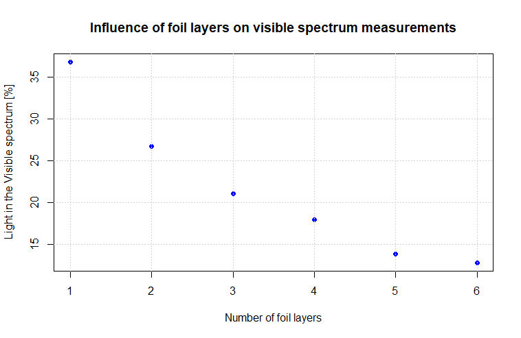{width=75%}

As the first foil layer already reduced the measured solar radiation by approximately 60%, we decided that one foil layer was sufficient. 
The foil layer was placed on the transparent lid of the enclosure for the sensor, secured with double-sided tape.

### Conversion into irradiance values
The TSL2591 sensor does not measure an irradiance value with a measuring unit, but it measures a value between 0 and the saturation value. By holding the sensor in direct sunlight on a sunny day at noon, it was possible to find bring the sensor to saturation for the visible light. The saturation value for the visible light is 37888. It was soon clear that by holding the sensor in direct sunlight the saturation value for the IR radiation channel would never be reached. An attempt was made to hold the sensor very close to a source of heat (and therefore of IR radiation), such as the cooking stove, but the sensor overheated and there was damage to the jumper cables, long before the IR saturation threshold was reached. The datasheet confirms that the maximum ADC (analog-to-digital converters) count is 37888. And since no distinction is made between the two different ADC (that get values for the two channels: IR and visible), the saturation value of 37888 was set also for the IR measurements, even if not tested.

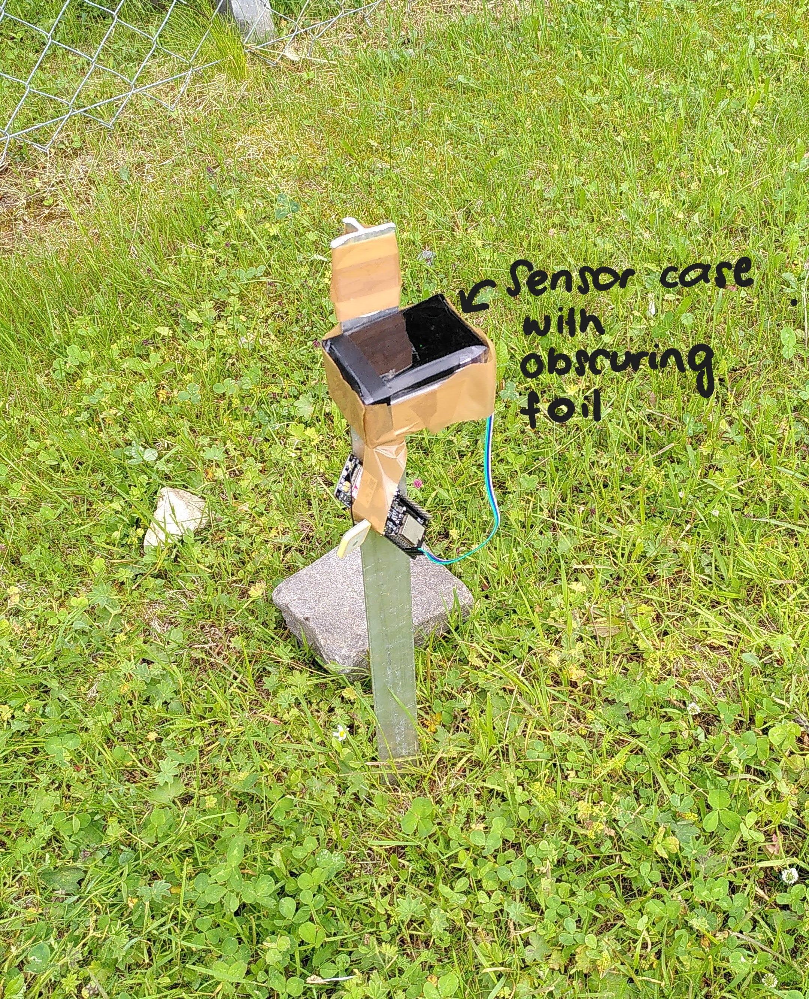{width=50%}

However, to be able to convert these measurements without unit to irradiance measurements it would be necessary to compare the TSL2591 measurements to some known values. This was achieved by placing the sensor near the SLF2 station, and comparing some irradiance measurements with the measurements that the TSL2591 sensor took at the same time. The sensor was placed horizontally, at 3-4 meters from the SLF2 station, and it was made sure that nothing was casting a shade on it, possibly disturbing the measurements.

## Ultrasonic distance sensor (Grove & HCSR-04) and laser distance sensor (VL53L0X)
Sound speed depends on the temperature of the medium it travels in. The two different ultrasonic distance sensors that were tested measure two different parameters: the HCSR-04 measures the duration of signal, that is the time it takes for the sound signal to travel from the sensor to the surface and back to the sensor. The Grove sensor outputs the distance to the surface and assumes a sound speed of 340 m/s (see. Datasheet of the sensor). To observe and test this influence of temperature on the measured distance, a known distance was measured at two distinctively different temperatures: ambient temperature at around 25.0 °C, and -25 °C, in a room of the cold lab at SLF. The sensors were fixed on a box and measured two different distances: the height of the box (the distance to the table the box was placed on) and the height to the floor. The laser distance sensor served as a sort of control measurement, since laser distance measurements should not be influenced by the ambient temperature.

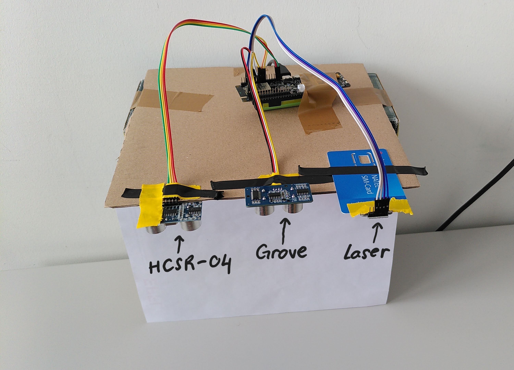{width=45%} 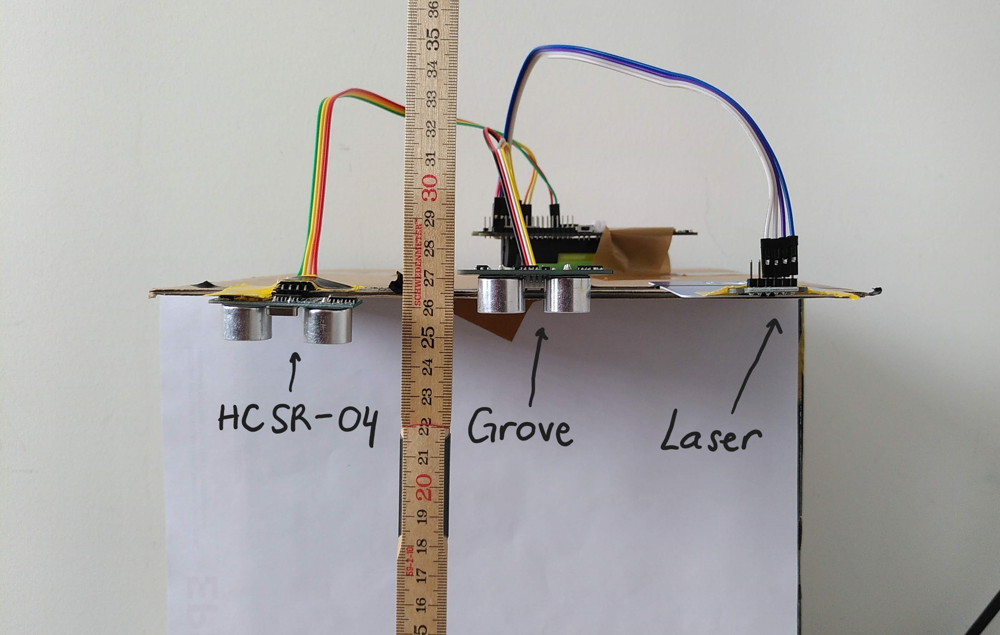{width=45%}

The results showed a significant overestimation of the distance by cold temperatures. As expected, the longer the distance measured, the bigger the error by cold temperature.

|   | Grove | HCSR-04 | Laser |
|---|---|---|---|
| **Temperature: 25.8 °C** |   |   |   |
| Measurement with meter [cm] | 25.7 | 24.8 | 26.2 |
| Sensor measurement [cm] | 25 | 24.99 | 28.7 |
| **Temperature: -25.0 °C** |   |   |   |
| Measurement with meter [cm] | 25.7 | 24.8 | 26.2 |
| Sensor measurement [cm] | 28 | 27.40 | 28.1 |
| Measurement with meter [cm] | 95.5 | 95.5 | 101 |
| Sensor measurement [cm] | 111 | 106.36 | 101.5 |
| **Temperature: 24.6 °C** |   |   |   |
| Measurement with meter [cm] | 99.1 | 98.5 | 99.6 |
| Sensor measurement [cm] | 101 | 97.0 | 104.2 |

When measuring a distance of 95.5 cm at -25 °C, the Grove sensor measured almost 15 cm more, and the HCSR-04 ca. 10 cm more. Surprisingly, the laser sensor measured much more accurately at low temperature than at around 25 °C, where it measured with an error up to +4 cm. Several measurements were taken to be able to average them. The Laser and the HCSR-04 sensors showed some variability of about 1 cm between the measurements. The Grove sensor, however, was very consistent, as no variability was observed between the multiple measurements that were taken.
These observations made clear that it was necessary to introduce a temperature correction of the distance measurements. The following function was used to calculate the distance as a function of the actual temperature:\
$$ c = 331.2 * (1 + \frac{T[°C]}{273})^\frac{1}{2} $$\
The ambient temperature measured by the Grove temperature and humidity sensor, placed in the radiation shield, was used in this formula for the distance calculation.

## Surface temperature via IR radiation (MLX90614)
The approach used to test the MLX90614 (surface IR temperature sensor) consists in measuring the surface of a body of known temperature. For this purpose, an ice bath was chosen, the temperature of was kept under control with a thermometer (to notice eventual changes in temperature), and the surface of the ice bath was measured with the MLX90614 at different distances.

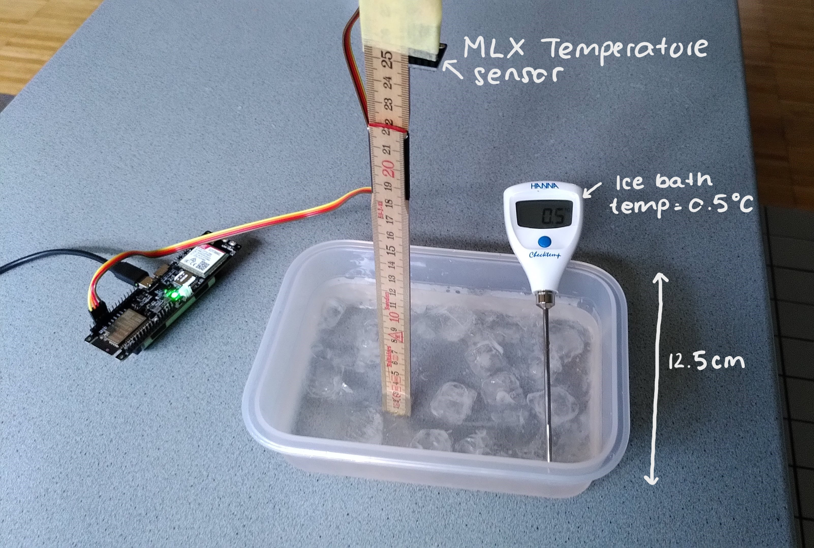{width=75%}

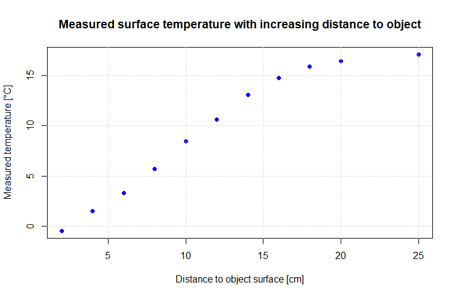{width=75%}

Two observations were made. The measurements of the surface temperature of the ice baths at the same distance were almost constant (variability in the order of 0.05 °C). This proves that the sensor measurements are consistent. However, the measured temperature increased rapidly with increase distance from the target, at 10 cm distance from the ice bath, the measurement had an error of + 8 °C.
This quite large error is due to the broad field of view of the sensor. The datasheet shows that the type MLX90614xAA receives signal from an angle of incidence of ca. + 60° and – 60 °. This means that it receives signal from a total angle of 120°.

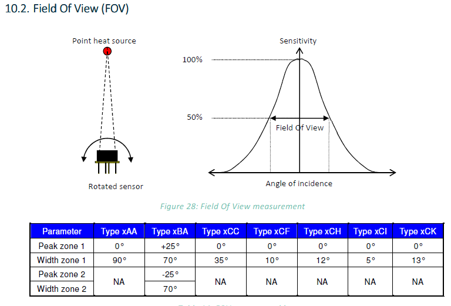{width=75%}
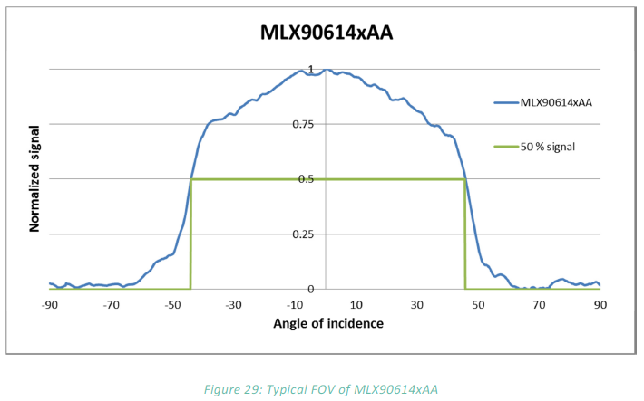{width=50%}

As the container for the ice bath was not very big, as soon as the distance from it was too high, the sensor started to receive signal not only from the water at 0.5 °C, but also from the objects around it (for example the table). As the following scheme shows, already from a vertical distance of 3.6 cm, the measured signal does not only come from the ice bath, but also from the surface around it.

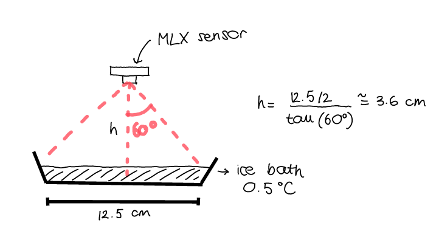{width=50%}

This would represent a problem for the station, as the MLX90614 would have to be placed quite high (at least at 1.5 m from the ground) for it to measure snow height, but this means that it would also measure other objects on the snow surface (for example the pole of the weather station). For this reason, it was decided to order another type of MLX90614 sensor: the MLX90614xCC, which has a total contribution of the signal from ca. 60° (total field of view of 35°).

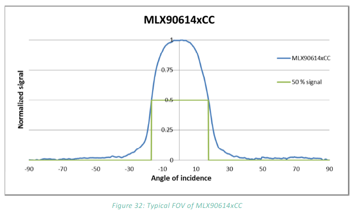{width=50%}

The following scheme shows at which distance from the vertical pole of the station the sensor MLX90614xCC would have to be placed for it not to measure the temperature of the station pole. The calculations were done for two different sensor heights: 1.5 m and 2 m above ground.

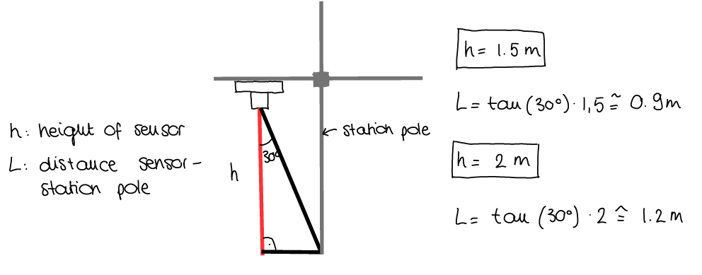{width=75%}

The accuracy of the MLX90614xCC sensor was tested with an IR thermometer, which proved an accuracy of 0.5°C up to 2m distance from the target (no point target but diffuse, as the snow surface).

## Temperature and humidity sensors (Grove and SHT30)
These sensors were tested at different temperatures using a thermometer (which we also used during fieldwork to measure the snow temperature, with error of 0.1 °C) to check that the measurements were precise. The temperature measurements of both sensors were accurate. The humidity measurements were not tested with another device but were compared between each other, and it was observed that the two sensors measured very similar moisture values (up to 1% difference).

The first idea was to use two SHT30 sensors to measure both air and soil temperature and humidity, because they are well resistant to rust and are suitable for outside use. As they are identical, they have the same I2S address. It was not possible to change the I2C address of one of them in software, and since the circuit was not exposed, also not in hardware. An attempt was made at creating two I2C lines within the program, to be able to connect each one of the SHT30 to a different line. This did not work, so it was necessary to use a different sensor for the air temperature and humidity measurements. The Grove temperature and humidity sensor was chosen for this task.
