This page documents how to assemble the physical stations from their parts. 

## Busboard

Since the [Lilygo T-SIM7000G](https://www.lilygo.cc/products/t-sim7000g) board only has two 3V3 pins, three GND and one SCL and SDA, and since we need these pins for almost every sensor (the 3V3 and GND for every sensor, and the SCL and SDA for all [I2C](https://www.i2c-bus.org/) sensors), we need to chain (daisy chain) the different sensors. In order to do this you can solder some pins to a busboard (see the image below).

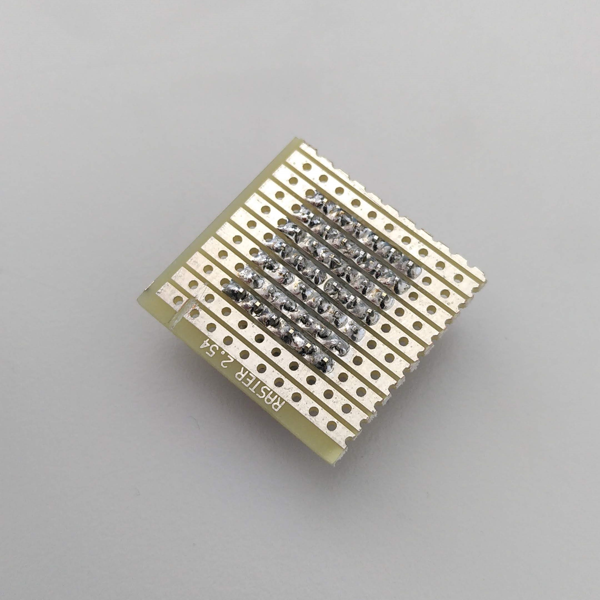{width=200 height=200px}   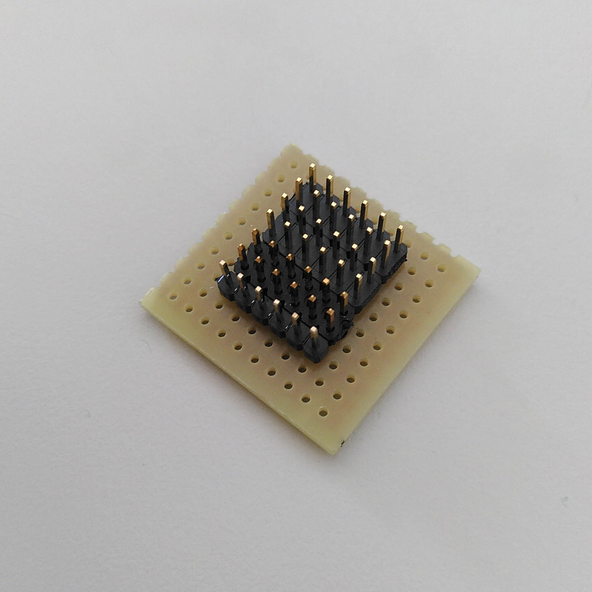{width=200 height=200px}

Then, if you connect a 3V3 pin of the Lilygo board to the busboard with a jumper wire, you can connect all the other sensors that need an input of 3.3V to the pins on the same line of the busboard. When everything is connected the result looks something like this:

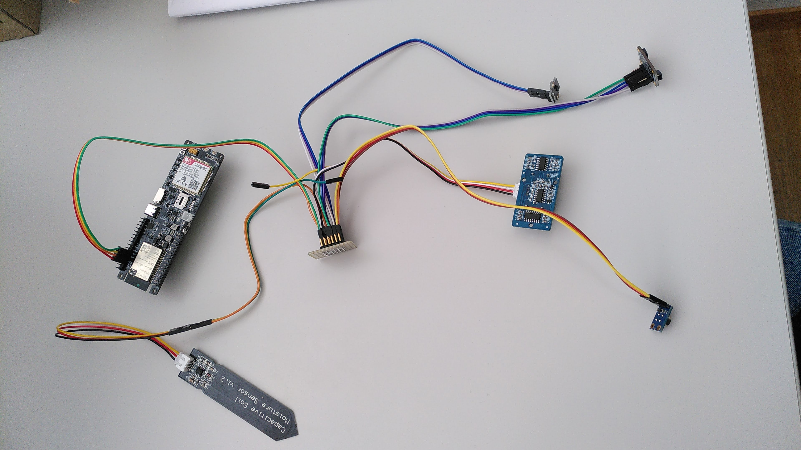{width=500 height=500px}

## Solar panels

To choose adequate solar panels for this project, the following points have been considered:

- for the [Lilygo T-SIM7000G](https://www.lilygo.cc/products/t-sim7000g), solar panels that have a voltage between 4.4V and 6V are recommended. If this voltage is exceeded, the board could suffer from damage (click [here](https://github.com/Xinyuan-LilyGO/LilyGO-T-SIM7000G) to see notes in README on the Github of the board).
- the solar panels should have around 4W of power, to make the whole station work.
- the solar panels should be sturdy, to be able to be fixed on the station and to resist environmental influences.

After considering these points, a relatively cheap solar panel has been chosen and purchased, one that still looked trustworthy: This is the [DEBO SOLAR 5W](https://www.reichelt.de/de/de/entwicklerboards-solarpanel-5-w-debo-solar-5w-p266039.html?r=1) from [reichelt.de](https://www.reichelt.de). Actually if no 4W solar panel would be  available, it would also be possible to use two 2W solar panels with a parallel connection.

The cable ending of the solar panel has then been cut off to be able to solder the two wires to the wire connection provided with the Lilygo board, in order to be able to connect the solar panels to the solar panel port of the board.

## Hardware modifications

This is a list of all the hardware modifications I had to do on the different electronics for the station.

- Solder the cable of the solar panels to the cable that connects to the solar panel interface of the board
- Solder multiple male connector headers (pins) to a busboard to daisy chain multiple sensors on the same I2C line, to be able to connect multiple sensors in series to the SCL, SDA, V3V and GND pins of the board (as explained earlier in the section 'Busboard')
- If necessary, solder the male connector headers pins (which have been provided with the sensors) to the sensors
- Replace the cable plugs of the SHT30 sensors (in the picture below on the left), to put the female jumper cables plugs (crimp connectors)

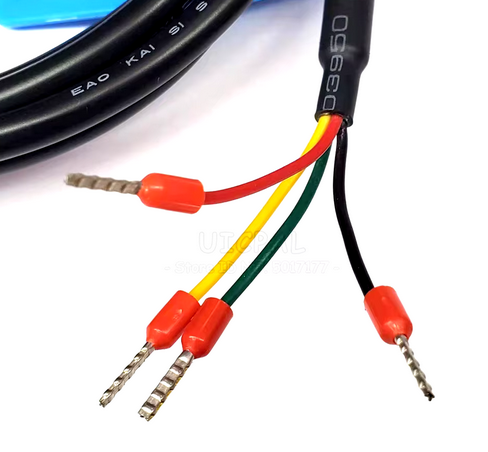{width=25%}
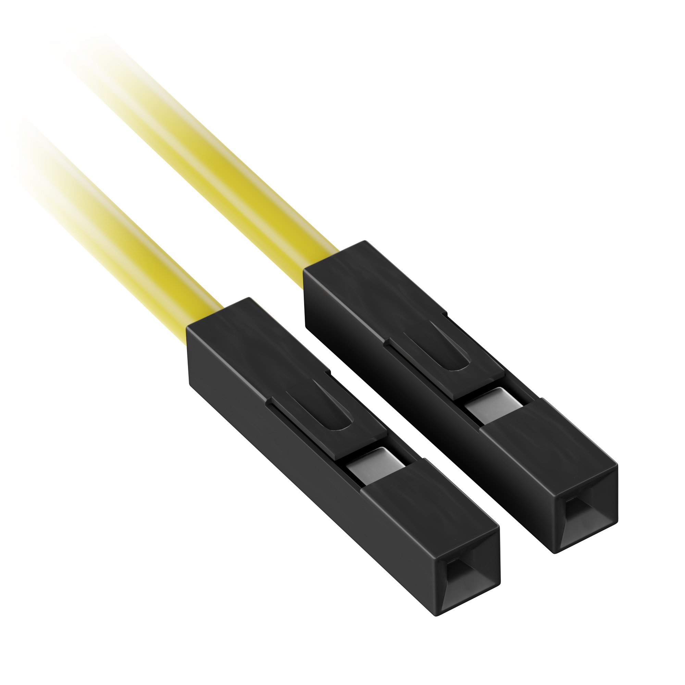{width=25%}

- Prepare the cables that are going to connect the sensors to the board: cut them at the desired length and put female jumper cable plugs (crimp connectors) on the wires of one cable end. For the cables that are going to be connected to I2C sensors (TSL2591, SHT30 and MLX90614) put the female jumper cable plugs on the other cable end as well. For both Grove sensors (they have a special 4-pin Grove interface), solder the wires to the Grove cable (that has the 4-pin Grove interface), by previously cutting the Grove plug on one end, and secure the soldered part with a heat shrink tube.

## Board setup
The following scheme shows which pins of the Lilygo board were used and which interfaces of the board were connected to antennas, or other cables.

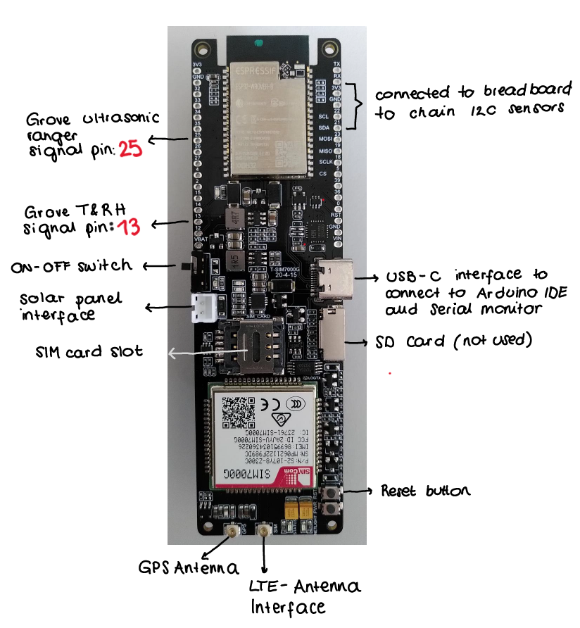{width=50%}

## Station setup
This is a scheme of how the station was setup on the Weissfluhjoch Versuchsfeld of SLF.
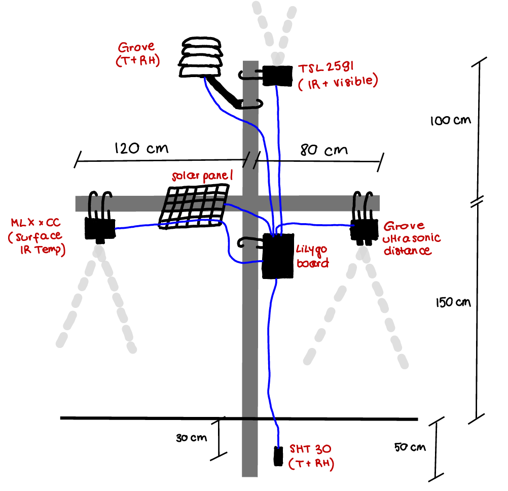{width=75%}

The following steps explain the approach taken to build the station:

- A steel pole of ca. 30 mm diameter was used as the vertical pole of the station, and an aluminum pole of ca. 45 mm diameter was used as the horizontal pole.
- After the vertical pole was put about 40-50 cm deep into the ground, it was secured with 4 cables (ca. 4.5 m long, for lack of shorter ones) that were hammered into the ground. The horizontal pole was then fixed on the vertical pole at a height of ca. 1.88 m above the ground, with West-East orientation. The orientation of the horizontal pole prevents the station from creating shade on its own sensors. This works because in winter the sun rises at SE and sets in SW, with a path in the sky that passes south to Zenith at midday.
- The TSL2591 light sensor was placed horizontally, on the top vertical pole, oriented to the south. This way we prevent other parts of the station casting shadows on the radiation sensor.
- The radiation shield containing the Grove temperature and humidity sensor was placed on the top of the vertical pole, oriented to the north.
- The horizontal pole was fixed so that one side was longer than the other: ca. 0.8 m on the side of the Grove distance sensor, and 1.2 m on the side of the MLX90614 sensor, to prevent the MLX90614 sensor of measuring also the surface temperature of the station pole. Both sensors (Grove and MLX90614) were placed at the most outwards position on the horizontal pole. The solar panel was placed on the horizontal arm, on the same side as the MLX90614, tilted at approximately 45° facing the south, to catch the most sunlight (in winter).
- The SHT 30 sensor was placed 30 cm deep in the ground, at ca. 20 cm distance from the pole of the station, to avoid potential influences.
- The electronic housing containing the Lilygo board was placed on the vertical pole just below the horizontal pole.
- To fix all electronic housing of the sensors on the poles metal plates were screwed to the electronic housing. The sensors and the solar panel on the horizontal pole were fixed using cable ties, as they only have to stay horizontal, and the casings on the vertical poles were fixed with metal rings.  
- Since the Grove ultrasonic distance sensor and the surface IR- temperature sensor must have the sensor part sticking outside of the casing, circular holes were drilled into the plastic casing. After inserting the sensors, the holes were made waterproof with silicone finish.
- Cable glands were used in all electronic casings, in order to make the cable entries in the casings waterproof.

## Test station on Weissfluhjoch

In the following section are some pictures of the test station, mounted on the Weissfluhjoch test field.

The casing with the ultrasonic distance sensor (left) and the casing with the surface IR-temperature sensor (right):

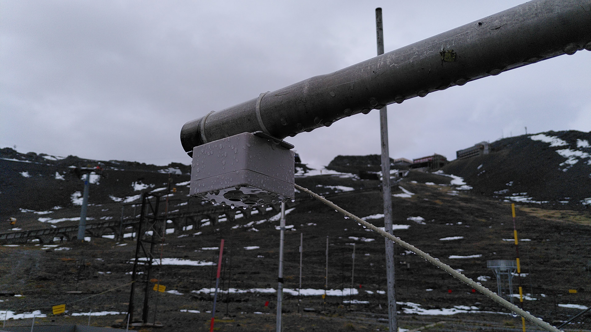{width=40%}
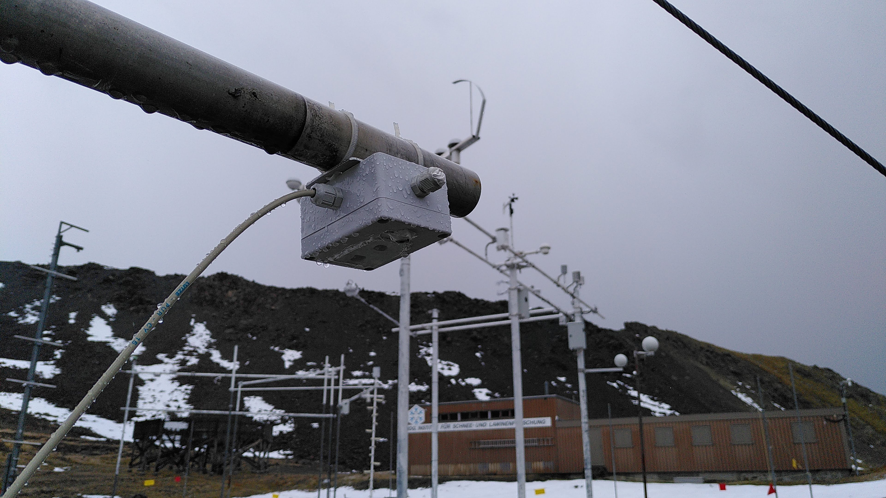{width=40%}

The whole station, up-close on the right:

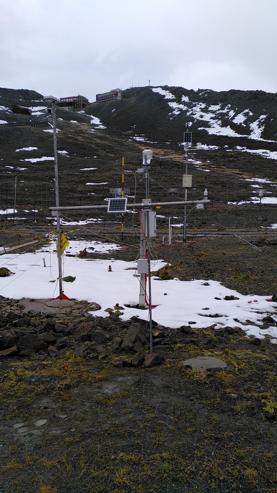{width=40%}
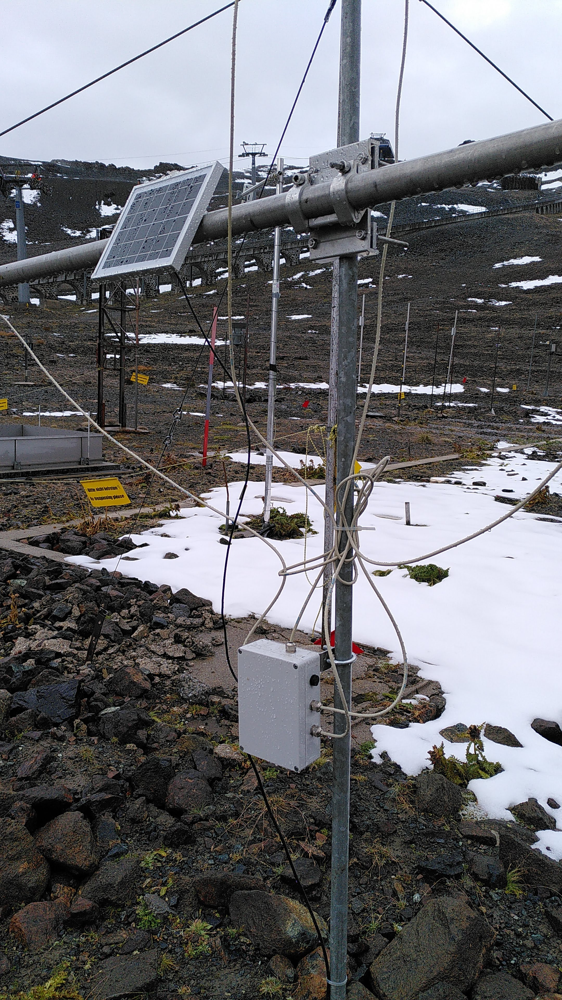{width=40%}